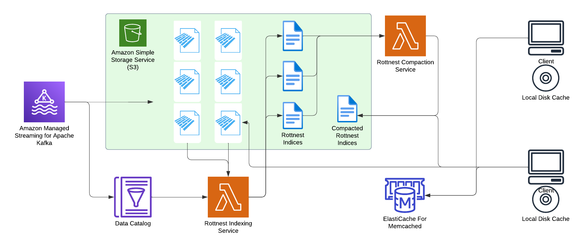

# Rottnest : Data Lake Indices

**Despite our affiliations, this is not an official Anthropic-supported project!** Please raise issues here on Github.

You don't need ElasticSearch or some vector database to do full text search or vector search. Parquet + Rottnest is all you need. Rottnest is like Postgres indices for Parquet. Read more on what it can do for e.g. logs [here](LogCloud.pdf).

## Installation

Currently, the recommended installation is build from source.
```
maturin develop --release --features py
```
Rottnest supports an extension for compressing and searching log data (very experimental)
```
maturin develop --release --features "py,logcloud"
```

## How to use

Build indices on your Parquet files, merge them, and query them. Very simple. Let's walk through a very simple example, in `demo.py`. It builds a BM25 index on two Parquet files, merges the indices, and searches the merged index for records related to cell phones. The code is here:

```
import rottnest
rottnest.index_file_bm25("example_data/0.parquet", "body", "index0")
rottnest.index_file_bm25("example_data/1.parquet", "body", "index1")
rottnest.merge_index_bm25("merged_index", ["index0", "index1"])
result = rottnest.search_index_bm25(["merged_index"], "cell phones", K = 10)
```

This code will still work if the Parquet files are in fact **on object storage**. You can copy the data files to an S3 bucket, say `s3://example_data/`. Then the following code will work:

```
import rottnest
rottnest.index_file_bm25("s3://example_data/0.parquet", "body", "index0")
rottnest.index_file_bm25("s3://example_data/1.parquet", "body", "index1")
rottnest.merge_index_bm25("merged_index", ["index0", "index1"])
result = rottnest.search_index_bm25(["merged_index"], "cell phones", K = 10)
```

The indices themselves can also be on object storage. 

Rottnest client will use the index to search against the Parquet files on S3 directly. Rottnest has its own Parquet reader that makes this very efficient.

If you are using S3-compatible file systems, like Ceph, MinIO, Alibaba or Volcano Cloud that might require virtual host style and different endpoint URL, you should set the following environment variables:

```
export AWS_ENDPOINT_URL=https://tos-s3-cn-beijing.volces.com
export AWS_VIRTUAL_HOST_STYLE=true
```

Rottnest not only supports BM25 indices but also other indices, like regex and vector searches. More documentation will be forthcoming.

### Phrase Matches

Unlike BM25 which works on single terms, you can also build exact substring match indices which rely on the FM-index (for the moment). This is based on *exact match*. We are working on a Kmer-hash based method with minimizers to reduce the storage size. The code is here:

```
import rottnest
rottnest.index_file_substring("example_data/0.parquet", "body", "index0")
rottnest.index_file_substring("example_data/1.parquet", "body", "index1")
rottnest.merge_index_substring("merged_index", ["index0", "index1"])
result = rottnest.search_index_substring(["merged_index"], "cell phones", K = 10)
```

### Vector Approximate Nearest Neighbor

## Serverless Search Engine Architecture



Rottnest can be used to build a serverless search engine. The client will use the index to search against the Parquet files on S3 directly, or Parquet files hosted by somebody else, like Huggingface. More documentation will be forthcoming. The (simplest possible) searcher Lambda code can be found in lambda/ directory.

## Development

### Build Python wheel
```bash
maturin develop --features "py,opendal"
```
or 
```bash
maturin develop --features "py,aws_sdk"
```
